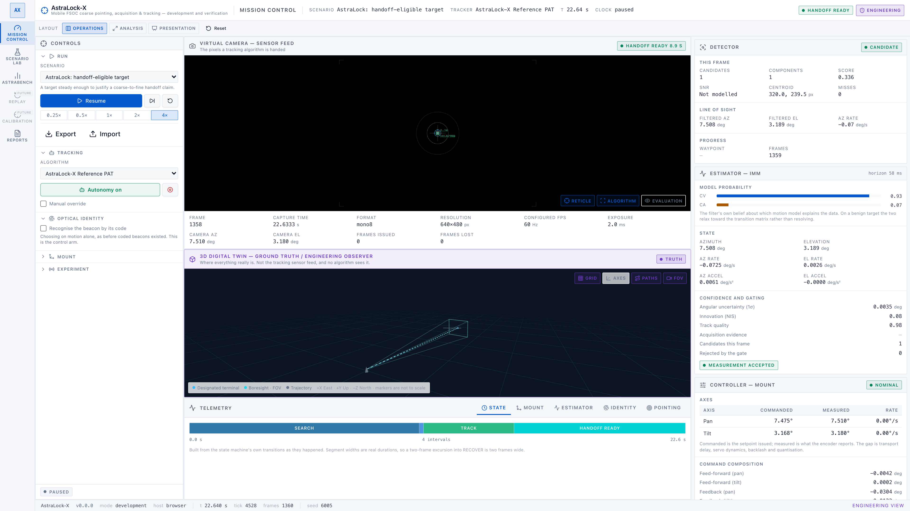
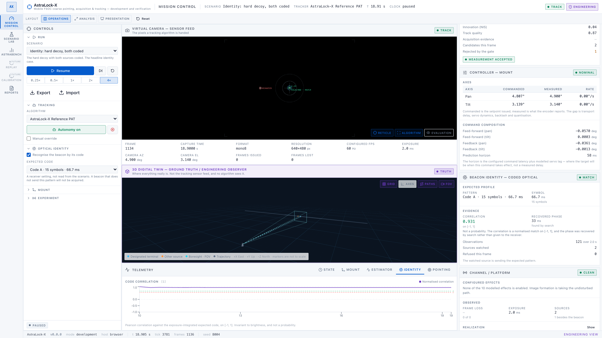
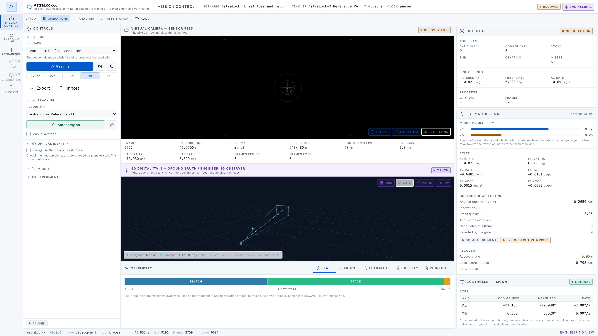
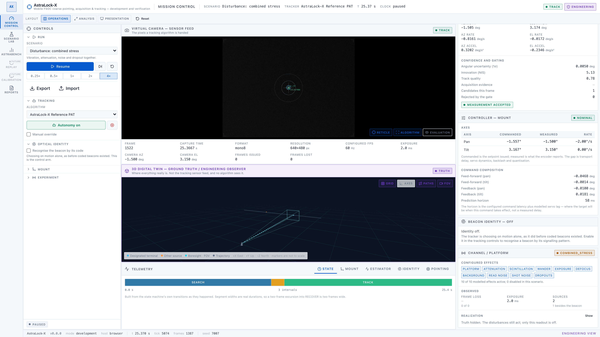
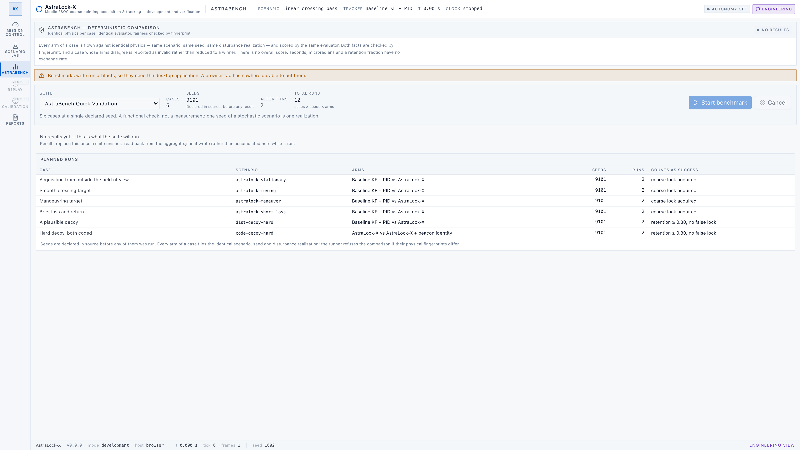

# AstraLock-X

Engineering workbench for coarse **Pointing, Acquisition and Tracking (PAT)** of
mobile **Free Space Optical Communication (FSOC)** links.

[](https://github.com/Pranavsingh431/AstraLock-X/actions/workflows/ci.yml) [](LICENSE) [](https://github.com/Pranavsingh431/AstraLock-X/actions/workflows/ci.yml) [](docs/PHASE_STATUS.md)

[](https://tauri.app) [](https://react.dev) [](https://www.typescriptlang.org) [](https://www.rust-lang.org) [](https://nodejs.org)

A cross-platform desktop application for developing, simulating and benchmarking
coarse PAT systems. It runs offline. Every experiment is reproducible, and every
number it reports was measured rather than illustrated.



<sub>Mission Control at HANDOFF READY. White workstation chrome, a dark virtual sensor feed, a dark 3D engineering viewport. Every value on screen was computed by the run it describes.</sub>

> **Status: prototype complete and frozen.**
> Ten development phases. CI green on Linux, macOS and Windows.
> Everything documented below is built and measured. Anything not built is
> listed as not built.
>
> **New here?** Start with **[HANDOFF.md](HANDOFF.md)**. It covers running the
> project, the invariants you must not break, and what is left to build.

---

## The problem

A mobile FSOC link is a laser between two moving platforms. The beam is narrow,
often around a milliradian. So the two ends have to find each other, then stay
pointed at each other while both platforms move and vibrate.

Coarse PAT is the first stage of that. A gimbal and a camera search for the
other terminal, acquire it, and hold it inside the capture range of the fine
pointing stage.

The hard part is the failure modes. They are rare and conditional: a disturbance
peak landing during a dropped frame, a target crossing a gimbal travel limit, a
filter that is confidently wrong. These are expensive to study on hardware and
cheap to study in simulation. But only if the simulation is honest about what
the tracker can see, and only if a failed run can be reproduced.

## The approach

**The tracker cannot see the answer.**
The simulator knows where every target is. A tracking algorithm never does. It
receives camera frames and measured gimbal encoder readings, and nothing else.
Five independent mechanisms enforce this: the type system, a registration-time
check, a lint barrier, `.test-d.ts` proofs, and a runtime guard. It fails
closed, so a type the compiler cannot prove ground-truth-free is rejected rather
than admitted. See [ADR-0003](docs/adr/0003-ground-truth-isolation.md) for why,
and [docs/ALGORITHM_PLUGIN.md](docs/ALGORITHM_PLUGIN.md) for the enumeration.

**Every run is reproducible.**
A run is fully determined by its configuration and its seed. There is no
wall-clock input and no unseeded randomness. Each stochastic subsystem draws
from its own stream, so adding noise in one place does not silently change
results everywhere else
([ADR-0004](docs/adr/0004-deterministic-seeded-experiments.md)).

**Nothing is fabricated.**
Every number displayed came from a computation that ran. A view with no data is
empty and says why. A quantity the system does not model reports null, never a
plausible guess. [docs/SIMULATION.md](docs/SIMULATION.md) lists those
explicitly.

**The renderer is a view, not the simulation.**
The authoritative world is plain TypeScript. It runs without React, Three.js or
a browser, so one code path serves the tests, the interactive UI and a headless
runner ([ADR-0006](docs/adr/0006-engineering-coordinate-convention.md)).

## The headline result

A plausible decoy used to capture either tracker. Coded beacon identity fixes
it. Both runs below used identical physics, the same scenario and the same seed.
The only difference is whether the receiver was told to look for a code.

| Measure                    | Identity off |    Identity on |
| -------------------------- | -----------: | -------------: |
| False-lock episodes        |            3 |          **0** |
| False-lock duration        |       19.4 s |      **0.0 s** |
| Lock retention             |        0.279 |      **0.907** |
| Post-acquisition RMS error | 282 337 µrad | **2 652 µrad** |

That is a 106× reduction in pointing error from one receiver setting. The
tracker is the same in both runs. Both recompute from their own raw files with
zero differences.

[docs/PPT_EVIDENCE.md](docs/PPT_EVIDENCE.md) has the figures and where they came
from. [docs/PHASE_STATUS.md](docs/PHASE_STATUS.md) is the full ledger.

## Workspaces

| Workspace       | Purpose                                       | State                             |
| :-------------- | :-------------------------------------------- | :-------------------------------- |
| Mission Control | Fly a scenario and watch the tracker work     | Built                             |
| Scenario Lab    | Author and validate experiment configurations | Built                             |
| AstraBench      | Compare algorithms across scenarios and seeds | Built                             |
| Reports         | Inspect and verify recorded runs              | Built                             |
| Replay          | Step through a completed run                  | Future work, and the view says so |
| Calibration     | Estimate intrinsics and gimbal alignment      | Future work, and the view says so |

The interface has two modes.

**Engineering view** is the default. It may draw privileged simulator state:
ground truth, the 3D twin, the actuator interior, the true pointing error. Each
of those is violet-edged and labelled.

**Flight-representative view** removes all of them at once. What is left is only
what a real terminal's own software could compute. It changes what is drawn and
nothing else, so the same run produces the same numbers either way.

[docs/UI_GUIDE.md](docs/UI_GUIDE.md) has the design rules.

## What it looks like working



<sub>**Coded beacon identity** on the hard-decoy scenario. Two modulating sources are in frame. The overlay marks one MISMATCH in red and the other SELECTED · MATCH in green. The detector reports two candidates with one rejected by the gate. No simulator identifier appears anywhere the algorithm can see, because it is never given one.</sub>



<sub>**RECOVER.** The beacon has gone. The tracker is coasting on its own prediction: the uncertainty ring has visibly grown, 57 consecutive misses, recovery age 0.95 s. The PAT timeline shows the amber excursion at the end of a TRACK run. The capture waited for the tracker to enter this state on its own.</sub>



<sub>**Combined disturbance.** Vibration, attenuation, sensor noise and frame dropout acting together. The sensor image really is that noisy. It is the frame the algorithm received, not a filter over a clean one.</sub>



<sub>**AstraBench preflight.** Every case with its scenario, arms, declared seed and success rule, shown **before** the run. "The comparison was decided in advance" is only a claim you can check if the plan is on screen.</sub>

Each image is real application state. The capture drove the actual controls and
waited for the tracker's own PAT state. Provenance for every one is in
[artifacts/sih/screenshots/README.md](artifacts/sih/screenshots/README.md).
[docs/SCREENSHOT_GUIDE.md](docs/SCREENSHOT_GUIDE.md) says how to reproduce them.

## Getting started

You need Node.js 24 LTS, Corepack, and [rustup](https://rustup.rs). The exact
pnpm and Rust versions are pinned by the repository, so nothing else needs
choosing. [docs/DEVELOPMENT.md](docs/DEVELOPMENT.md) has the full setup.

```bash
corepack enable
pnpm install --frozen-lockfile
pnpm tauri:dev
```

Frontend only, in a browser:

```bash
pnpm dev
```

Everything CI runs:

```bash
pnpm verify
```

Recording experiments and running benchmarks need the desktop build, because
they write run artifacts to disk. In a browser tab those workspaces say so and
disable themselves.

## Documentation

**Start here**

| Document                                | What is in it                                       |
| :-------------------------------------- | :-------------------------------------------------- |
| [HANDOFF.md](HANDOFF.md)                | Running it, the invariants, the traps, what is left |
| [ARCHITECTURE.md](docs/ARCHITECTURE.md) | How the system is put together                      |
| [PHASE_STATUS.md](docs/PHASE_STATUS.md) | What works and what does not                        |
| [DEVELOPMENT.md](docs/DEVELOPMENT.md)   | Setup, commands, conventions                        |
| [adr/](docs/adr/)                       | Why things are the way they are, in 25 records      |

**The simulation**

| Document                                          | What is in it                                                     |
| :------------------------------------------------ | :---------------------------------------------------------------- |
| [SIMULATION.md](docs/SIMULATION.md)               | Coordinates, clock, PRNG, trajectories, and what is not modelled  |
| [SENSOR_MODEL.md](docs/SENSOR_MODEL.md)           | Projection, camera clock, point spread, the frame contract        |
| [GIMBAL_MODEL.md](docs/GIMBAL_MODEL.md)           | Servo dynamics, latency, deadband, backlash, encoder quantisation |
| [DISTURBANCE_MODEL.md](docs/DISTURBANCE_MODEL.md) | Platform, propagation, sensor and transport disturbances          |

**The algorithms**

| Document                                        | What is in it                                                 |
| :---------------------------------------------- | :------------------------------------------------------------ |
| [ASTRALOCK_PAT.md](docs/ASTRALOCK_PAT.md)       | The reference tracker: states, IMM, gating, recovery, handoff |
| [BASELINE_PAT.md](docs/BASELINE_PAT.md)         | The control arm: detector, Kalman filter, PID, search         |
| [BEACON_IDENTITY.md](docs/BEACON_IDENTITY.md)   | Coded optical identity: the codes, the correlator, its limits |
| [ALGORITHM_PLUGIN.md](docs/ALGORITHM_PLUGIN.md) | Writing a tracker: what arrives, what it cannot reach         |

**Measurement**

| Document                              | What is in it                                            |
| :------------------------------------ | :------------------------------------------------------- |
| [METRICS.md](docs/METRICS.md)         | Every KPI formula, denominator, unit and N/A rule        |
| [EXPERIMENTS.md](docs/EXPERIMENTS.md) | Recording a run: lifecycle, artifacts, recomputation     |
| [REPORTING.md](docs/REPORTING.md)     | The offline report and the Reports screen                |
| [ASTRABENCH.md](docs/ASTRABENCH.md)   | Fairness fingerprints, paired seeds, aggregation, limits |

**Interface and submission**

| Document                                        | What is in it                                      |
| :---------------------------------------------- | :------------------------------------------------- |
| [UI_GUIDE.md](docs/UI_GUIDE.md)                 | Colour and its meanings, the primitives, the rules |
| [PPT_EVIDENCE.md](docs/PPT_EVIDENCE.md)         | Verified results and their provenance              |
| [SIH_COMPLIANCE.md](docs/SIH_COMPLIANCE.md)     | Requirements mapped to what exists, gaps marked    |
| [SCREENSHOT_GUIDE.md](docs/SCREENSHOT_GUIDE.md) | Exact settings for each submission screenshot      |

## Scope

This is a prototype. It is complete and frozen for a submission. It is a
development and verification workbench, not flight software, and it makes no
claim of flight readiness.

**Built and measured.** The deterministic digital twin. The virtual optical
camera. The dynamic gimbal. Two autonomous PAT algorithms. Physically
parameterized disturbances. Coded optical beacon identity. Experiment recording
with recomputable reports. Deterministic benchmarking.

**Deliberately not built.** Replay. Calibration. Hardware-in-the-loop. A learned
verifier. An operating-envelope explorer. These are labelled as future work in
the interface rather than hidden, and [HANDOFF.md](HANDOFF.md) says where each
one would start.

## Licence

[MIT](LICENSE)
